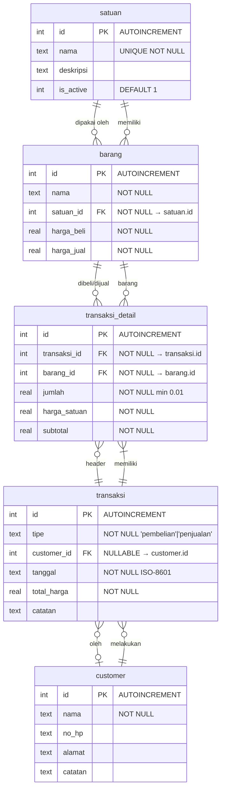

# Sipo — Entity Relationship Diagram (ERD)

> **Sipo** — Simple POS v0.1.0
> **Date:** 2026-07-31
> **Status:** Draft — awaiting approval

---

## 1. ERD Diagram

---

## 2. Table Definitions

### 2.1 satuan

Master satuan barang.

| Column | Type | Constraint | Notes |
|--------|------|------------|-------|
| `id` | INTEGER | PRIMARY KEY AUTOINCREMENT | — |
| `nama` | TEXT | NOT NULL, UNIQUE | Contoh: "kg", "liter", "pcs" |
| `deskripsi` | TEXT | NULLABLE | Keterangan tambahan |
| `is_active` | INTEGER | NOT NULL DEFAULT 1 | 1 = active, 0 = soft-deleted |

**Indexes:**
- `idx_satuan_nama` ON `satuan(nama)` — untuk search
- `idx_satuan_active` ON `satuan(is_active)` — untuk filter

### 2.2 barang

Master barang/barang yang diperjualbelikan.

| Column | Type | Constraint | Notes |
|--------|------|------------|-------|
| `id` | INTEGER | PRIMARY KEY AUTOINCREMENT | — |
| `nama` | TEXT | NOT NULL | Nama barang |
| `satuan_id` | INTEGER | NOT NULL, FK → satuan.id | Referensi satuan |
| `harga_beli` | REAL | NOT NULL | Harga beli per satuan (decimal 2) |
| `harga_jual` | REAL | NOT NULL | Harga jual per satuan (decimal 2) |

**Indexes:**
- `idx_barang_nama` ON `barang(nama)` — untuk search
- `idx_barang_satuan` ON `barang(satuan_id)` — untuk join

**Foreign Key:**
- `satuan_id` → `satuan(id)` ON DELETE RESTRICT (tidak bisa hapus satuan yang dipakai)

### 2.3 customer

Master customer/supplier.

| Column | Type | Constraint | Notes |
|--------|------|------------|-------|
| `id` | INTEGER | PRIMARY KEY AUTOINCREMENT | — |
| `nama` | TEXT | NOT NULL | Nama customer/supplier |
| `no_hp` | TEXT | NULLABLE | Nomor HP |
| `alamat` | TEXT | NULLABLE | Alamat |
| `catatan` | TEXT | NULLABLE | Catatan tambahan |

**Indexes:**
- `idx_customer_nama` ON `customer(nama)` — untuk search

### 2.4 transaksi

Header transaksi (pembelian atau penjualan).

| Column | Type | Constraint | Notes |
|--------|------|------------|-------|
| `id` | INTEGER | PRIMARY KEY AUTOINCREMENT | — |
| `tipe` | TEXT | NOT NULL | CHECK('pembelian', 'penjualan') |
| `customer_id` | INTEGER | NULLABLE, FK → customer.id | Wajib pembelian, opsional penjualan |
| `tanggal` | TEXT | NOT NULL | ISO-8601 format "YYYY-MM-DD HH:mm:ss" |
| `total_harga` | REAL | NOT NULL | Sum semua detail subtotal |
| `catatan` | TEXT | NULLABLE | Catatan transaksi |

**Indexes:**
- `idx_transaksi_tipe` ON `transaksi(tipe)` — untuk filter analitik
- `idx_transaksi_tanggal` ON `transaksi(tanggal)` — untuk filter range
- `idx_transaksi_customer` ON `transaksi(customer_id)` — untuk lookup

**Constraints:**
- CHECK(`tipe` IN ('pembelian', 'penjualan'))
- CHECK(`total_harga` >= 0)

### 2.5 transaksi_detail

Detail item dalam satu transaksi.

| Column | Type | Constraint | Notes |
|--------|------|------------|-------|
| `id` | INTEGER | PRIMARY KEY AUTOINCREMENT | — |
| `transaksi_id` | INTEGER | NOT NULL, FK → transaksi.id | Referensi header |
| `barang_id` | INTEGER | NOT NULL, FK → barang.id | Referensi barang |
| `jumlah` | REAL | NOT NULL | Jumlah (decimal, min 0.01) |
| `harga_satuan` | REAL | NOT NULL | Harga per satuan saat transaksi |
| `subtotal` | REAL | NOT NULL | = jumlah × harga_satuan |

**Indexes:**
- `idx_detail_transaksi` ON `transaksi_detail(transaksi_id)` — untuk join
- `idx_detail_barang` ON `transaksi_detail(barang_id)` — untuk analitik

**Foreign Keys:**
- `transaksi_id` → `transaksi(id)` ON DELETE CASCADE
- `barang_id` → `barang(id)` ON DELETE RESTRICT

---

## 3. Relationship Rules

| Relationship | Rule |
|-------------|------|
| satuan → barang | RESTRICT — tidak bisa hapus satuan yang dipakai barang |
| barang → transaksi_detail | RESTRICT — tidak bisa hapus barang yang punya riwayat transaksi |
| transaksi → transaksi_detail | CASCADE — hapus transaksi = hapus semua detailnya |
| customer → transaksi | SET NULL — hapus customer tidak menghapus transaksi |

---

## 4. Decimal Handling

- SQLite REAL = 64-bit floating point.
- **Hanya 2 decimal places** untuk semua harga dan jumlah.
- Validation di application layer (Dart): `double.parse(value).toStringAsFixed(2)`.
- Drift column type: `real` dengan double precision.

---

## 5. Data Volume Estimates

| Table | Rows (1 tahun operasi) | Est. Size |
|-------|------------------------|-----------|
| satuan | < 20 | < 1KB |
| barang | < 500 | < 50KB |
| customer | < 200 | < 20KB |
| transaksi | < 10,000 | < 500KB |
| transaksi_detail | < 30,000 | < 1MB |
| **Total** | — | **< 2MB** |

Well within NFR target (< 50MB).

---

## 6. Migration Strategy

- v0.1.0: Schema initial (no migration needed).
- Drift handles schema versioning. Set `schemaVersion: 1` pada initial setup.
- Future migrations: increment version + `onUpgrade` callback.
